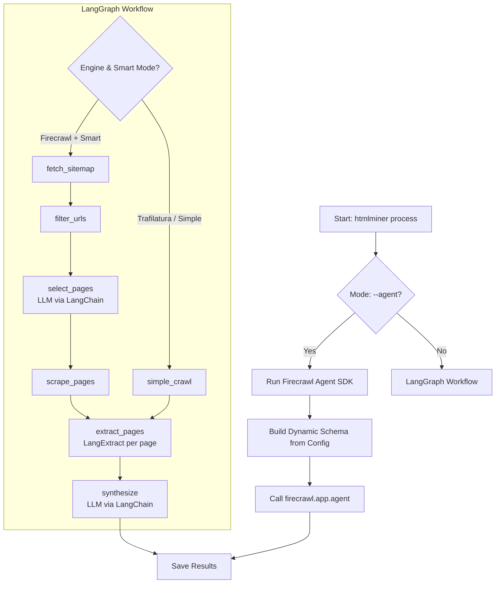

# HTMLMiner

Agentic web domain analyzer powered by Google Gemini and Firecrawl.

## Installation

### What is `uv`?
`uv` is a fast Python package and project manager from Astral. It installs Python (if needed), creates an isolated environment, and manages dependencies so the CLI runs consistently across machines.

### Install `uv`
Pick one option, then confirm with `uv --version`.

**macOS (Homebrew)**
```bash
brew install uv
```

**Linux/macOS (installer script)**
```bash
curl -LsSf https://astral.sh/uv/install.sh | sh
```

**Windows (PowerShell)**
```powershell
irm https://astral.sh/uv/install.ps1 | iex
```

### Install HTMLMiner (recommended)
Install the CLI directly from GitHub:
```bash
uv tool install git+https://github.com/andreifoldes/htmlminer.git
```
This makes the `htmlminer` command available globally.

> [!NOTE]
> This method requires **Git** to be installed on your system.
>
> **Install Git:**
> - **macOS:** `brew install git` or download from [git-scm.com](https://git-scm.com/download/mac)
> - **Linux:** `sudo apt install git` (Debian/Ubuntu) or `sudo dnf install git` (Fedora)
> - **Windows:** Download from [git-scm.com](https://git-scm.com/download/win)
>
> **Don't have Git?** You can install HTMLMiner without it by downloading from PyPI (once published) or by cloning the repo manually and using the development install method below.

### Update HTMLMiner
Pull the latest version with:
```bash
uv tool upgrade htmlminer
```

### Install for development
From the project root (the folder that contains `pyproject.toml`), sync dependencies and install in editable mode:
```bash
uv sync
```
This creates a `.venv` virtual environment, installs all dependencies from the lockfile, and links the package to your working copy so changes in `src/` are picked up immediately.

Run commands using:
```bash
uv run htmlminer process --url https://example.com
```

Or activate the environment first:
```bash
source .venv/bin/activate  # macOS/Linux
.venv\Scripts\activate     # Windows
htmlminer process --url https://example.com
```

### Platform notes
HTMLMiner runs on Windows, macOS, and Linux. `uv` takes care of Python, virtual environments, and dependencies across platforms.

### API Key Setup

HTMLMiner needs API keys to function. You have two options:

**Option 1: Interactive Prompts (Recommended for first-time users)**
- Just run any command - if API keys are missing, you'll be prompted to enter them
- The CLI will securely ask for your keys and offer to save them to `.env` automatically
- Keys are hidden during input for security

**Option 2: Manual Setup**
- Copy `.env.template` to `.env`
- Add your API keys:
  ```bash
  GEMINI_API_KEY=your_key_here
  FIRECRAWL_API_KEY=your_key_here  # Optional for some modes
  ```

**Required Keys:**
- `GEMINI_API_KEY` - Required for all extraction modes. Get it from [Google AI Studio](https://aistudio.google.com/app/apikey)
- `FIRECRAWL_API_KEY` - Required for `--agent` mode, optional but recommended for `--engine firecrawl`. Get it from [Firecrawl](https://firecrawl.dev/)

## How it Works

The following diagram illustrates the decision tree and logic flow used by HTMLMiner to extract features from websites:



## Usage

### Batch Processing (File)
```bash
htmlminer process --file test_urls.md
```
Supports `.md`, `.txt`, `.csv`, and `.tsv` files. Only valid `http://` or `https://` URLs are processed.

### Single URL Processing
```bash
htmlminer process --url https://deepmind.google/about/
```

### Using Firecrawl Engine
```bash
htmlminer process --url https://openai.com/safety/ --engine firecrawl
```

### Controlling Summary Length
Set per-feature length guidance in `config.json` using the `length` field (e.g., "1 short paragraph (2-4 sentences)").

### Limiting Synthesis Context
Cap the number of longest snippets per feature that are fed into synthesis (default is 50):
```bash
htmlminer process --url https://anthropic.com/ --synthesis-top 50
```

### Choosing Gemini Model Tier
Select a cheaper or more capable model for extraction and synthesis:
```bash
htmlminer process --url https://anthropic.com/ --gemini-tier expensive
```

### Agent Mode (Firecrawl Agent SDK)
Use Firecrawl's Agent SDK for autonomous web research. This mode uses Spark 1 models to intelligently search and extract data without manual crawling:
```bash
# Default: spark-1-mini (cost-efficient)
htmlminer process --url https://example.com --agent

# For complex tasks: spark-1-pro (better accuracy)
htmlminer process --url https://example.com --agent --spark-model pro
```

> **Note:** Agent mode requires `FIRECRAWL_API_KEY` and uses Firecrawl's credit-based billing.

### CLI Output (Results + Token Usage)
After a run, the CLI prints:
- **Agentic Extraction Results:** a table with one row per URL and one column per configured feature (e.g., Risk/Goal/Method). The `Counts` column shows how many raw extracts were found for each feature.
- **Token Usage Report:** per-step breakdown of model usage, including call counts and total duration.
  - **Prompt Tokens:** input tokens sent to the model (the scraped content plus instructions).
  - **Completion Tokens:** output tokens generated by the model.
  - **Total Tokens:** the sum of prompt + completion tokens.

## Configuration

### `config.json`
`config.json` controls *what* the agent extracts. Each entry in `features` defines:
- `name`: the label for the dimension in results
- `description`: what the extractor should look for
- `synthesis_topic`: how the summary for that dimension should be framed
- `length`: optional length guidance for the model's summary
- `output_format`: optional output style (`number`, `list`, `free_text`, `single_choice`, `multi_choice`)
- `output_categories`: optional list of categories for `single_choice` or `multi_choice` (array of strings or comma-separated string)

**Output Categories Formatting**
`output_categories` can be either:
- Comma-separated string: `"policy work, research papers, grantmaking"`
- JSON array: `["policy work", "research papers", "grantmaking"]`

**Config file lookup order:**
1. `--config /path/to/custom.json` - Use a specific config file
2. `./config.json` - Use config.json in current directory (if exists)
3. Built-in defaults - Risk, Goal, Method features

**Using a custom config:**
```bash
htmlminer process --url https://example.com --config /path/to/my-config.json
```

Example configuration:
```json
{
    "features": [
        {
            "name": "Risk",
            "description": "Any mentioned risks, dangers, or negative impacts of AI development.",
            "synthesis_topic": "Their risk assessment (ie what risks does AI development pose)",
            "length": "1 short paragraph (2-4 sentences)",
            "output_format": "free_text"
        },
        {
            "name": "Goal",
            "description": "High-level goals, missions, or objectives (e.g., 'AI alignment' or global AI agreement).",
            "synthesis_topic": "The goals (often pretty high-level e.g. 'AI alignment')",
            "length": "1 short paragraph (2-4 sentences)",
            "output_format": "free_text"
        },
        {
            "name": "Method",
            "description": "Strategies, activities, or actions taken to achieve the goals (research, grantmaking, policy work, etc.).",
            "synthesis_topic": "The methods used in service of the goals",
            "length": "1 short paragraph (2-4 sentences)",
            "output_format": "free_text"
        },
        {
            "name": "Primary Method (single choice example)",
            "description": "Most prominent method or activity mentioned.",
            "synthesis_topic": "The primary method used by the organization",
            "output_format": "single_choice",
            "output_categories": "policy work, research papers, grantmaking, community building, product development"
        },
        {
            "name": "Methods (multi choice example)",
            "description": "All methods or activities mentioned (select all that apply).",
            "synthesis_topic": "All methods used by the organization",
            "output_format": "multi_choice",
            "output_categories": [
                "policy work",
                "research papers",
                "grantmaking",
                "community building",
                "product development"
            ]
        }
    ]
}
```

If you add or edit features, keep valid JSON and the same field names. A malformed `config.json` will stop the run with a parse error.

## Improving Extraction Quality

Try small CLI tweaks before changing code:
- **Model tier:** `--gemini-tier expensive` yields better extraction quality at higher cost.
- **Smart crawling:** Use `--smart` to automatically find and include content from sub-pages (e.g., `/about`, `/research`). This vastly improves context for the agent.
- **Feature page limit:** Use `--limit` to cap how many pages per feature are selected from the sitemap when smart crawling is enabled.
- **Engine choice:** `--engine firecrawl` often captures richer content; `--engine trafilatura` can be cleaner for text-heavy pages.
- **Summary length:** set per-feature `length` in `config.json` to guide how long each summary should be.
- **Input scope:** use `--file` with a curated URL list to avoid low-signal pages.

### Page Relevance Scores

When using smart crawling with Firecrawl, HTMLMiner assigns a **relevance score (1-10)** to each page selected for scraping. These scores indicate how relevant the LLM believes each page is for extracting the configured features (Risk, Goal, Method by default).

- Scores are saved to the `page_relevance` table in `htmlminer_logs.db`
- Scores are included in `results.json` under `metadata.relevance_scores`
- A score of 10 means highly relevant; 5 is the default for heuristically selected pages

To query relevance scores:
```bash
sqlite3 logs/htmlminer_logs.db "SELECT page_url, feature, relevance_score FROM page_relevance ORDER BY relevance_score DESC LIMIT 10;"
```

Note: there is no dedicated verbosity flag yet. For troubleshooting, check `htmlminer_logs.db` and consider adding a verbosity option if you need more console detail.


### Inspecting Raw Snapshots
If you want to view the raw HTML/Markdown content that was scraped for a specific URL, you can query the internal SQLite database using the command line:

```bash
sqlite3 logs/htmlminer_logs.db "SELECT content FROM snapshots WHERE url = 'https://example.com' LIMIT 1;"
```

Or list the latest 5 snapshots:
```bash
sqlite3 logs/htmlminer_logs.db "SELECT url, timestamp FROM snapshots ORDER BY timestamp DESC LIMIT 5;"
```

**Windows Note:** If `sqlite3` is not available on your Windows system, you can:
- Install it via `winget install SQLite.SQLite` or download from [sqlite.org](https://www.sqlite.org/download.html)
- Use a GUI tool like [DB Browser for SQLite](https://sqlitebrowser.org/)
- Query the database using Python: `python -c "import sqlite3; conn = sqlite3.connect('logs/htmlminer_logs.db'); print(conn.execute('SELECT url FROM snapshots').fetchall())"`

### Full CLI Options
```text
  --file TEXT             Path to markdown file containing URLs
  --url TEXT              Single URL to process
  --output TEXT           Path to output file [default: results.json]
  --config TEXT           Path to config.json with feature definitions [default: ./config.json or built-in defaults]
  --engine TEXT           Engine to use: 'firecrawl' or 'trafilatura' [default: firecrawl]
  --llm-timeout INT       Timeout in seconds for LLM requests (Gemini/DSpy), capped at 1200 [default: 1200]
  --gemini-tier TEXT      Gemini model tier: 'cheap' or 'expensive' [default: cheap]
  --smart                 Enable smart crawling to include sub-pages [default: True]
  --limit INT             Max pages per feature from sitemap when using --smart [default: 10]
  --agent                 Use Firecrawl Agent SDK for extraction (requires FIRECRAWL_API_KEY)
  --spark-model TEXT      Spark model for --agent mode: 'mini' or 'pro' [default: mini]
  --langextract           Enable LangExtract for intermediate extraction. If disabled (default), full page content is used for synthesis.
  --langextract-fast      Enable LangExtract fast mode (single extraction call per page for all features). Implies --langextract.
  --langextract-max-char-buffer INT  Max chars per chunk for LangExtract [default: 50000]
  --langextract-max-workers INT  Max parallel LangExtract workers per page [default: 1]
  --help                  Show this message and exit.
```
